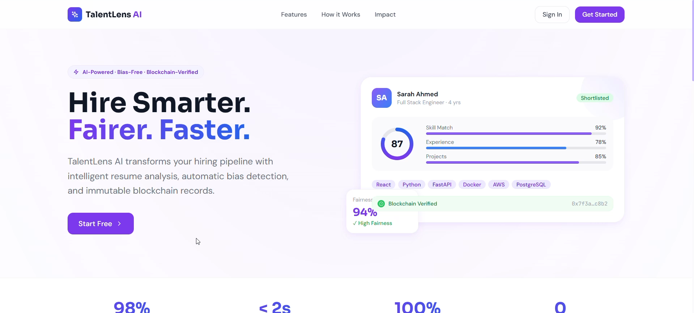
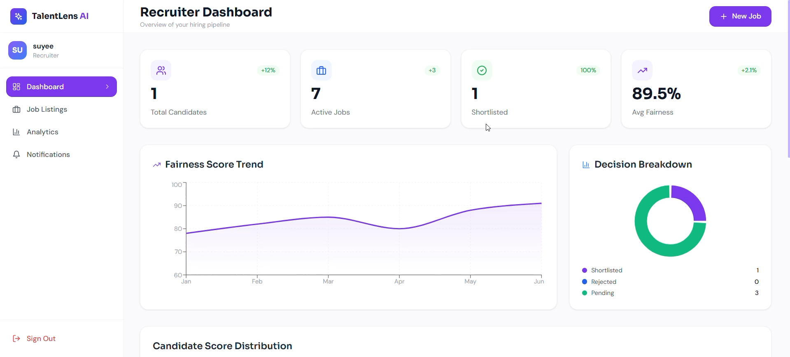
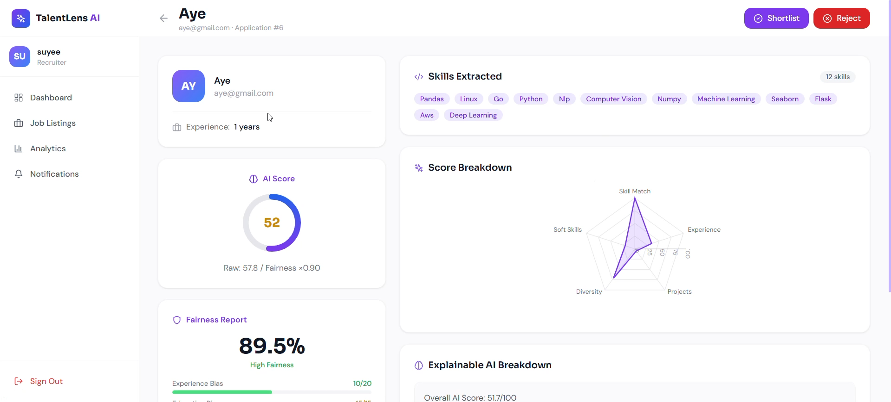
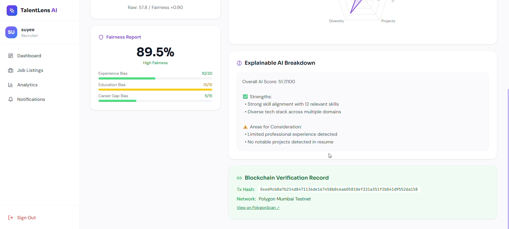

<h1 align="center">🔍 TalentLens AI: The Future of Fair Recruitment</h1>
<div align="center">

### 🎥 Live Demo Presentation

▶ **Watch the full platform demo here:**  
https://youtu.be/c-3yRsB1Ug4

<br>

<a href="https://youtu.be/c-3yRsB1Ug4">

</a>

</div>

---

## 📐 UI Prototype (Design Concept)

The early interface concept for **TalentLens AI** was designed in Figma to visualize the platform flow before development.

⚠️ This prototype is **non-responsive and represents a visual sketch only**.  
It demonstrates layout, navigation flow, and dashboard structure rather than a production UI.

🔗 **View the interactive prototype:**  
https://sky-sadly-16861013.figma.site

<br>

<a href="https://sky-sadly-16861013.figma.site">

</a>

---

<div align="center">


### Eliminating unconscious bias through identity-free AI and immutable blockchain audit trails.

*Resume Parsing · Bias Detection · Blockchain Verification · Explainable AI*

</div>

---

## 📸 Platform Preview

### 🏠 Landing Page


*Modern, accessible entry point for both Candidates and Recruiters.*

---

### 📊 Recruiter Dashboard and Analytics


*At-a-glance hiring funnels, score distributions, and one-click AI analysis.*

---

### 🧠 Explainable AI Analysis


*Identity-free semantic scoring with transparent, human-readable feedback.*

---

### ⛓️ Blockchain-Verified Decisions


*Every decision is securely hashed to the Polygon network for an immutable audit trail.*

---

## 📖 Table of Contents

- [🚩 Problem and Impact](#-problem-and-impact)
- [💡 Innovation and Enterprise Solution](#-innovation-and-enterprise-solution)
- [✨ Key Features](#-key-features)
- [🤖 AI and Data Analysis](#-ai-and-data-analysis)
- [⛓️ Blockchain Architecture](#️-blockchain-architecture)
- [🛠️ Tech Stack](#️-tech-stack)
- [🏗️ System and User Flow](#️-system-and-user-flow)
- [💻 Installation and Setup](#-installation-and-setup)

---

## 🚩 Problem and Impact

**The Broken State of Recruitment**

The global recruitment industry processes 750 million+ applications annually, yet relies on flawed, manual, or poorly automated systems.

| Problem | Statistic |
| :--- | :--- |
| **Unconscious Bias** | 47% of qualified candidates rejected due to non-merit factors — name, age, school prestige |
| **Zero Transparency** | 78% of candidates never receive meaningful feedback, violating GDPR Article 22 |
| **No Audit Trail** | 1 in 4 companies report disputed hiring records due to mutable, centralised databases |
| **Slow Screening** | Manual review of 100 resumes takes 40–60 hours per recruiter |

---

## 💡 Innovation and Enterprise Solution

**TalentLens AI** is an end-to-end, enterprise-ready recruitment ecosystem. We do not just automate hiring — we fundamentally re-engineer it for fairness and transparency.

**Identity-Free Architecture**
Candidate PII (name, email, phone) is separated from the resume before it reaches the AI model. The ranking engine only sees skills, experience, projects, and education — never who the person is.

**Mathematical Fairness**
Bias is not a warning label. It is a mathematical constraint. Our `FairnessFactor` automatically adjusts the final score if bias markers are detected, moving unfairly profiled candidates down the ranking automatically.

**Zero-Trust Auditing**
TalentLens AI is the first platform to log hiring decisions natively to the EVM-compatible Polygon Blockchain, creating a permanent, tamper-proof record that cannot be deleted — even by the platform owner.

---

## ✨ Key Features

### 🏢 For Enterprise Recruiters

- **One-Click AI Job Generation** — Auto-generate job descriptions and skill requirements from a single role title
- **Automated Semantic Screening** — Replaces keyword-matching ATS with context-aware Sentence-BERT embeddings
- **Bias Risk Dashboards** — View composite fairness scores across the entire applicant pool per job
- **Blockchain Decision Logging** — Protect against discrimination disputes with immutable on-chain proof
- **Multi-Candidate Comparison** — Gemini-powered side-by-side analysis with a ranked hiring recommendation

### 👤 For Candidates

- **Explainable AI Reports** — Every candidate sees exactly why they scored what they scored: Strengths, Concerns, Recommendations
- **Dynamic Status Badges** — Real application status: Under Review, Shortlisted, or Not Selected
- **Cryptographic Verification** — Verified badge with a public Polygonscan explorer link on every decided application
- **Resume Quality Score** — AI feedback on clarity, quantified impact, project depth, and ATS compatibility

---

## 🤖 AI and Data Analysis

Our AI engine uses a 3-layer pipeline that goes far beyond traditional string matching.

### Layer 1 — Semantic Embeddings (Sentence-BERT)

Uses `all-MiniLM-L6-v2` to compute 384-dimensional vector embeddings. Cosine similarity between vectors finds skill matches by meaning, not string equality.

```
"ML"     ≈  "Machine Learning"  ≈  "Supervised Learning"  →  0.94 similarity ✅
"React"  ≈  "React.js"                                    →  0.97 similarity ✅
"FastAPI" ≈  "Python backend"                             →  0.71 similarity ✅
```

### Layer 2 — Non-Linear Weighted Scoring

| Factor | Weight | Method |
| :--- | :---: | :--- |
| Skill Match | 40% | BERT cosine similarity against job requirements |
| Experience Depth | 25% | Non-linear curve, capped at 10 yrs to prevent seniority bias |
| Project Impact | 20% | Quantity + quality bonus for ML, production, distributed work |
| Skill Diversity | 10% | Coverage across 6 tech categories |
| Soft Skills | 5% | 8 keyword markers — Leadership, Agile, Scrum, Communication |

### Layer 3 — The 3-Layer Bias Detector

| Detector | What It Catches |
| :--- | :--- |
| **Experience Bias** | Penalising entry-level candidates, career changers, or returners unfairly |
| **Education Bias** | Over-weighting elite schools or under-valuing bootcamp / self-taught paths |
| **Career Gap Bias** | Penalising gaps from parental leave, illness, caregiving, or relocation |

> **The Fairness Formula**
> ```
> FairnessScore = 100 - (exp_bias × 0.40 + edu_bias × 0.35 + gap_bias × 0.25)
> FinalScore    = RawScore × (FairnessScore / 100)
> ```
> Bias does not just get flagged — it mathematically reduces the final score and repositions the candidate in the ranking.

---

## ⛓️ Blockchain Architecture

**Trustless Data Integrity on Polygon Mumbai**

Polygon was chosen over Ethereum mainnet because it is fully EVM-compatible (same Solidity, zero code changes) while costing ~$0.00002 per transaction versus $5–$30 on Ethereum — making per-decision logging viable at enterprise scale.

**The Contract — `TalentLensHiring.sol`**

```solidity
struct HiringRecord {
    bytes32 resumeHash;    // SHA-256 fingerprint of parsed resume JSON
    uint256 score;         // AI score × 100
    uint256 fairnessScore; // Fairness score × 100
    string  decision;      // "shortlisted" or "rejected"
    uint256 timestamp;     // Immutable block timestamp
    address recorder;      // Recruiter wallet address
    bool    exists;
}
mapping(uint256 => HiringRecord) private records;
```

**The Process**

1. Recruiter clicks **Log to Blockchain**
2. Backend computes `SHA-256(resume JSON)` and produces `resumeHash`
3. `logHiringDecision()` writes the record to Polygon — permanently and immutably
4. Transaction hash is returned and displayed as a **Verified badge** on the candidate's profile
5. Anyone can call `verifyRecord(appId, hash)` to confirm the decision was not altered

---

## 🛠️ Tech Stack

| Layer | Technology | Role |
| :--- | :--- | :--- |
| **Frontend** | React 18, TailwindCSS, ShadCN UI | Responsive dashboards, XAI report rendering, Recharts analytics |
| **Backend API** | FastAPI (Python 3.11) | Async endpoints, background task queue for AI processing |
| **AI / NLP** | Sentence-BERT, spaCy, scikit-learn | NER skill extraction, cosine similarity scoring, bias detection |
| **Blockchain** | Solidity 0.8.19, Web3.py, Polygon | Immutable EVM smart contract for hiring decision records |
| **Data Layer** | SQLAlchemy, MySQL / SQLite | Relational ORM for all application state |
| **Auth** | JWT (python-jose), bcrypt (passlib) | Stateless role-based authentication |
| **Dev Tools** | Hardhat, Vite, Pydantic v2 | Contract deployment, frontend build, request validation |
---

## 💻 Installation and Setup

### Prerequisites

- Python 3.11+
- Node.js 18+
- Git

### 1 — Backend (FastAPI)

```bash
cd backend
python -m venv venv
source venv/bin/activate        # Windows: venv\Scripts\activate

pip install -r requirements.txt
python -m spacy download en_core_web_sm

cp .env.example .env            # fill in your values
mkdir uploads

uvicorn app.main:app --reload --port 8000
# API docs: http://localhost:8000/docs
```

### 2 — Frontend (React)

```bash
cd frontend
npm install

cp .env.example .env            # set VITE_API_URL=http://localhost:8000
npm run dev
# App: http://localhost:3000
```

### 3 — Blockchain (Optional)

Deploy the smart contract to Polygon Mumbai testnet:

```bash
cd smart_contracts
npm install
npx hardhat run deploy.js --network mumbai
# Output: Contract deployed to: 0xABC123...
# Copy this address into backend .env as CONTRACT_ADDRESS
# Free test MATIC: https://faucet.polygon.technology
```

> If `CONTRACT_ADDRESS` and `PRIVATE_KEY` are not configured, the system runs in **demo mode** automatically. A deterministic mock transaction hash is generated — the candidate experience is visually identical, the hash just does not live on a real chain. No wallet or testnet required for the demo.

### Environment Variables

```env
SECRET_KEY=your-secret-key
DATABASE_URL=sqlite:///./talentlens.db
UPLOAD_DIR=uploads
GEMINI_API_KEY=your-gemini-key
ALLOWED_ORIGINS=http://localhost:3000

# Blockchain — optional for demo mode
WEB3_PROVIDER_URL=https://rpc-mumbai.maticvigil.com
PRIVATE_KEY=your-wallet-private-key
CONTRACT_ADDRESS=0xYourDeployedContract
CHAIN_ID=80001
```

---

<div align="center">

Built with ❤️ for Hackathon 2026 &nbsp;|&nbsp; TalentLens AI &nbsp;|&nbsp; Fair Hiring for Everyone

</div>
